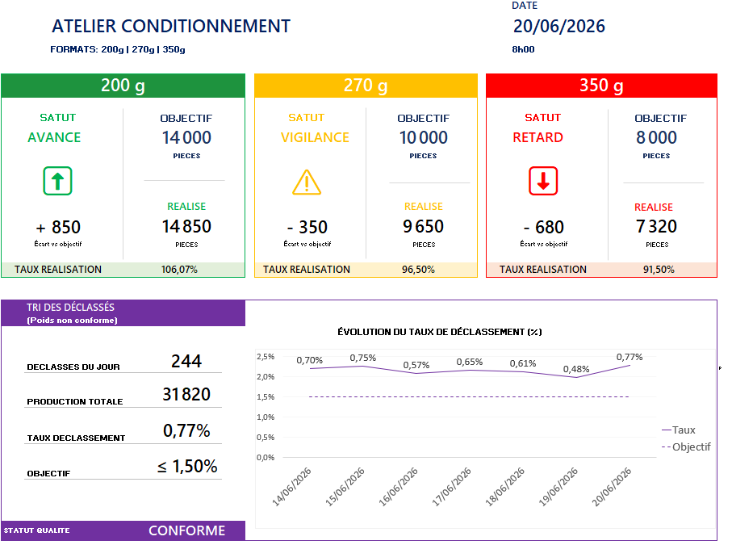

## Overview

Daily Performance Board is a practical Excel-based visual management tool designed for manufacturing teams.

It helps supervisors, team leaders and production managers monitor daily performance, review quality indicators and support operational discussions during shopfloor meetings, shift handovers and performance review sessions.

## Preview

*Example of the daily performance board used for production monitoring, quality tracking, visual management and operational review meetings.*

## Purpose

This tool is intended to:

- Monitor daily production performance
- Track quality losses and non-conforming products
- Support shopfloor discussions and decision-making
- Facilitate daily meetings and performance reviews
- Provide a printable visual management board for workshops and production areas

---

## Key Features

### Production Monitoring

- Daily production by product format
- Production target vs actual production
- Performance status:
  - 🟢 Ahead of target
  - 🟠 Attention required
  - 🔴 Behind target

### Quality Monitoring

- Daily non-conforming products
- Scrap / downgrade rate
- Quality objective tracking
- Historical trend visualization

### Visual Management

- Simple color-coded indicators
- Easy-to-read KPI cards
- One-page printable layout
- Suitable for workshop display boards

---

## Intended Use

The board can be used during:

- Daily stand-up meetings
- Shift handovers
- Morning production reviews
- Performance animation meetings
- Continuous improvement discussions
- Operational review meetings
- Management review sessions

---

## Benefits

- Fast data entry
- Clear operational visibility
- Standardized performance review
- Supports problem-solving discussions
- Encourages data-driven decisions
- Easy to deploy and maintain

---

## Technology

- Microsoft Excel
- Structured tables
- Dynamic formulas
- Conditional formatting
- Printable dashboard layout

No macros required.

---

## Example KPIs

### Production

- Daily Target
- Actual Production
- Production Gap
- Achievement Rate

### Quality

- Non-Conforming Products
- Downgrade Rate
- Quality Objective Compliance

### Trends

- 7-Day Downgrade Rate Trend
- Performance Evolution

---

## Target Audience

- Production Supervisors
- Team Leaders
- Shift Managers
- Continuous Improvement Engineers
- Operational Excellence Teams
- Plant Managers

---

## Project Goal

Provide a simple, accessible and effective visual management tool that helps production teams review performance, identify deviations and support operational discussions directly on the shopfloor.
