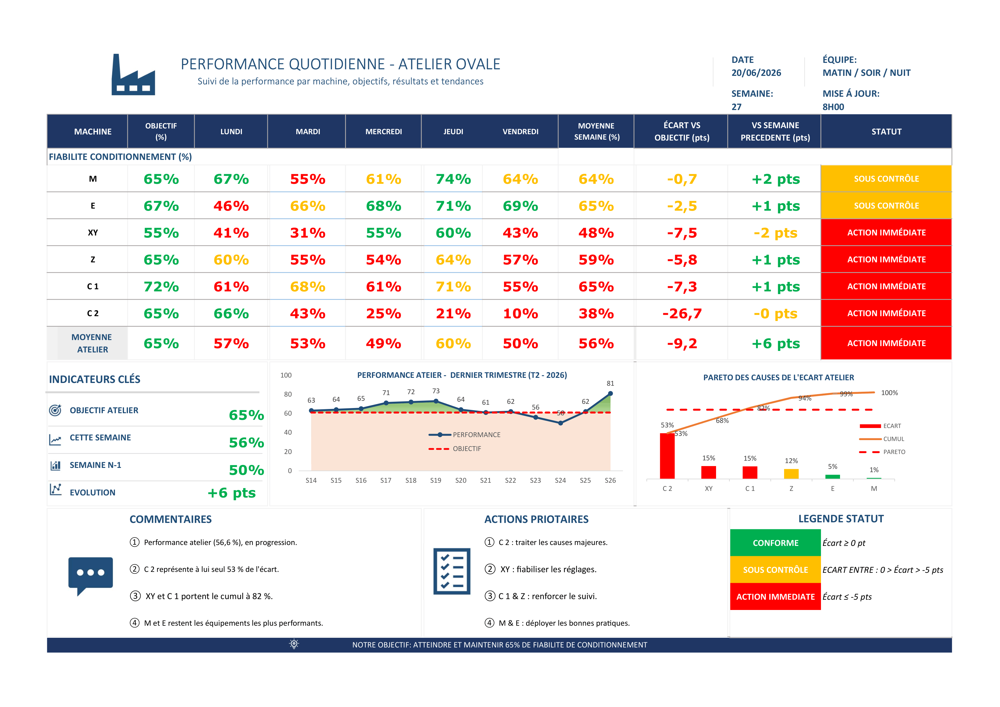

# Daily Performance Board

Outils Excel de management visuel conçus pour le pilotage de la performance en environnement industriel.

Ces supports permettent d'animer la performance au quotidien, de suivre les indicateurs clés et de faciliter les échanges lors des réunions terrain.

---

## Aperçu

### Pilotage Production & Qualité

Suivi quotidien :

- Production réalisée vs objectif
- Écarts de performance
- Déclassés / pertes qualité
- Taux de déclassement
- Tendances et indicateurs qualité

---

### Performance Atelier

Suivi hebdomadaire :

- Performance par machine
- Objectifs par équipement
- Moyenne atelier
- Comparaison semaine précédente
- Identification des priorités d'action

---

## Objectifs

Ces outils ont été développés pour :

- Standardiser le suivi de la performance
- Faciliter les réunions d'animation terrain
- Donner une vision claire des écarts
- Prioriser les actions correctives
- Renforcer le pilotage visuel en atelier

---

## Cas d'utilisation

Utilisation lors de :

- Passations de poste
- Réunions quotidiennes
- COPIL de performance
- Revues de production
- Points qualité
- Démarches d'amélioration continue

---

## Fonctionnalités

### Production

- Objectif vs réalisé
- Taux de réalisation
- Écart à l'objectif
- Statut visuel (🟢 🟠 🔴)

### Qualité

- Déclassés du jour
- Taux de déclassement
- Suivi des objectifs qualité
- Tendances historiques

### Performance Atelier

- Performance par machine
- Moyennes hebdomadaires
- Comparaison Semaine N / Semaine N-1
- Statuts visuels
- Priorisation des actions

---

## Technologies

- Microsoft Excel
- Tableaux structurés
- Formules dynamiques
- Mise en forme conditionnelle
- Supports imprimables A3

Aucune macro requise.

---

## Public visé

- Chefs d'équipe
- Responsables d'atelier
- Responsables production
- Ingénieurs amélioration continue
- Responsables performance industrielle
- Managers opérationnels

---

## Finalité

Transformer les données de production en supports visuels simples, lisibles et exploitables pour aider les équipes à prendre les bonnes décisions au quotidien.